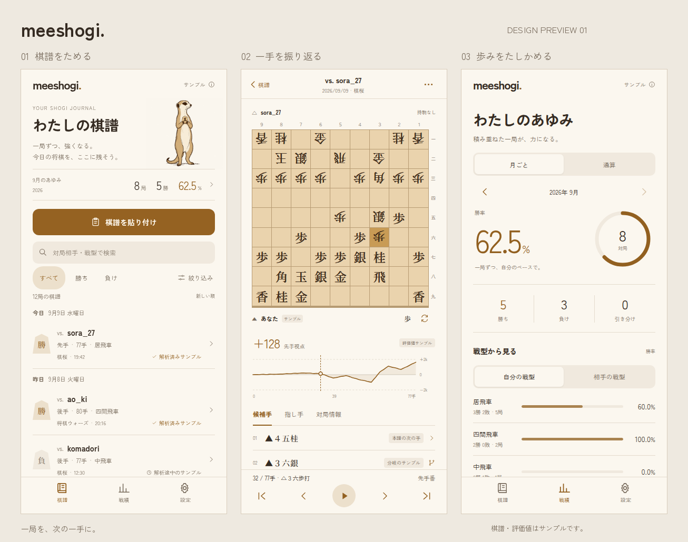

# meeshogi

ミーアキャットをマスコットにした、iOS・Android向け棋譜解析・戦績管理アプリ。

無料の端末内棋譜解析を土台に、将来は有料のLLM解説・助言を追加します。

## 状態

初期仕様と、操作できるHTMLモックを用意した段階です。棋譜一覧・解析画面・戦績・設定のデザインをブラウザで確認できます。ネイティブのアプリ本体、汎用の棋譜パーサー、実エンジン連携、GitHub Actionsのワークフローはまだ実装されていません。

## デザインプレビュー

[HTMLモックを開く](docs/mock/index.html) · [使い方と制約](docs/mock/README.md) · [デザイン参照](docs/mock/research.md) · [確認結果](docs/mock/verification.md)

meetermの温かい配色とミーアキャットの雰囲気を引き継ぎ、Appllamaで記録・統計アプリの実画面を参照しました。マスコットはImageGenで生成しています。画像・フォントをHTMLへ内蔵しているため、ファイル単体で開けます。

棋譜の検索・絞り込み、盤面の手送り、評価値グラフの操作、３手の分岐サンプル、サンプル取り込み、KIF書き出し、戦型修正、メモ・設定の保存を試せます。棋譜・戦績・評価値はサンプルで、実エンジンの解析やiOS・Androidネイティブアプリの動作を示すものではありません。

## 初期版の体験

1. 将棋ウォーズ・棋桜でコピーした棋譜を貼り付ける。
2. 端末内に保存し、一局全体を自動解析する。解析中も棋譜を操作できる。
3. 盤面・評価値グラフ・候補手から振り返り、自由に駒を動かして分岐を検討する。
4. 確定した1手詰め・3手詰めのバッジをタップして、答えを盤上で確認する。
5. 棋譜を蓄積し、勝敗・勝率や戦型別の戦績を確認する。

棋譜は端末内に保存し、KIFとして書き出せます。初期版ではアカウント登録や同期を必要としません。LLM解説・助言と課金は将来の機能です。

## 開発方針

- iOS・Androidを同時に進め、GitHub Actionsで両OSのビルド・起動・主要操作を検証する。
- `sekirei-weight`は実用的なweightの開発、本リポジトリはモバイル統合とアプリ体験を担当する。
- モックや固定の解析結果による画面検証と、実エンジンによる解析を区別する。
- まず無料版の一巡する体験を作る。LLM機能のためのサーバーや課金基盤を先行実装しない。

## 文書

- [初期版の製品仕様](docs/PRODUCT.md)
- [構成方針と未決事項](docs/ARCHITECTURE.md)
- [実装順序と両OSの検証](docs/DEVELOPMENT.md)
- [棋譜サンプルと取り込み期待値](fixtures/kif/README.md)
- [Codex向け作業指示](AGENTS.md)

## 関連プロジェクト

- [sekirei-weight](https://github.com/phni3j9a/sekirei-weight): 棋譜解析に使うweightの開発・評価。
- [meeterm](https://github.com/phni3j9a/meeterm): マスコットのシリーズと、両OSを並行検証する開発運用の参考。
