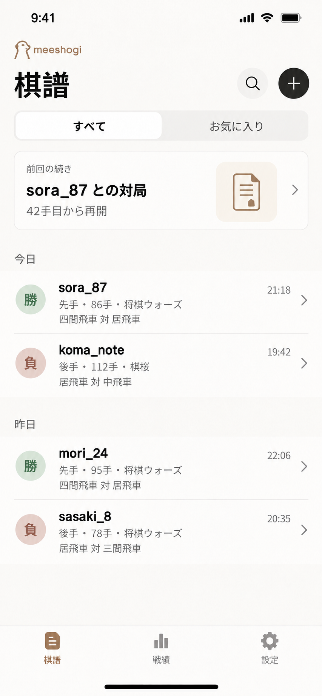
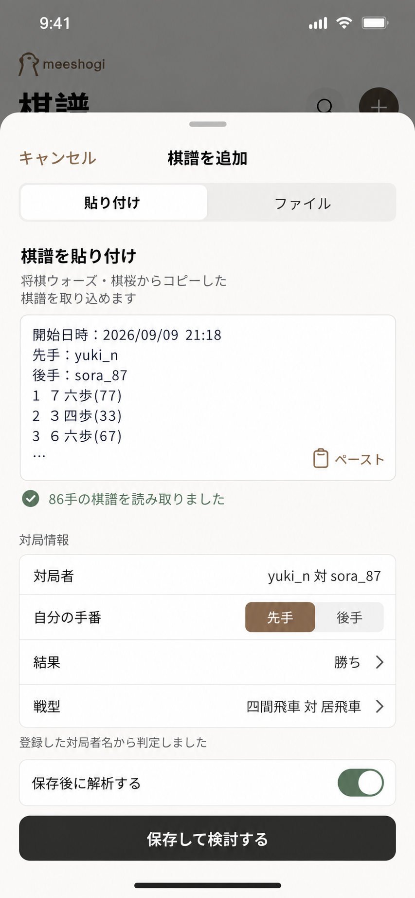
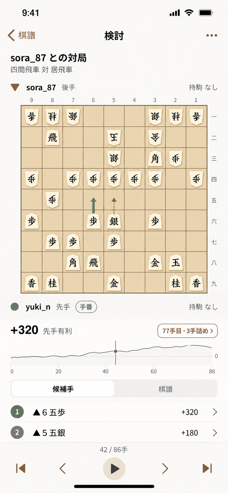
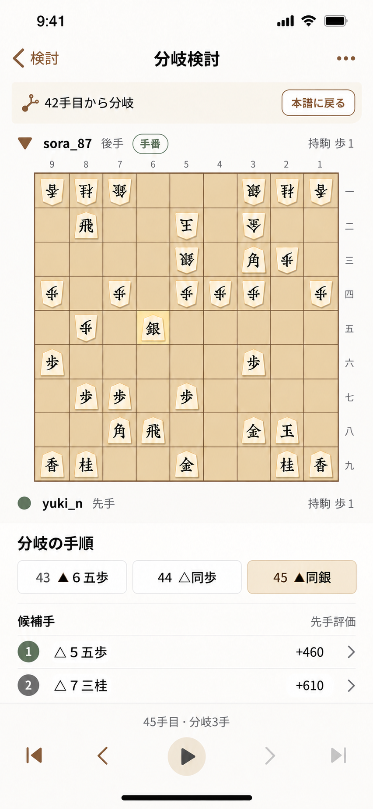
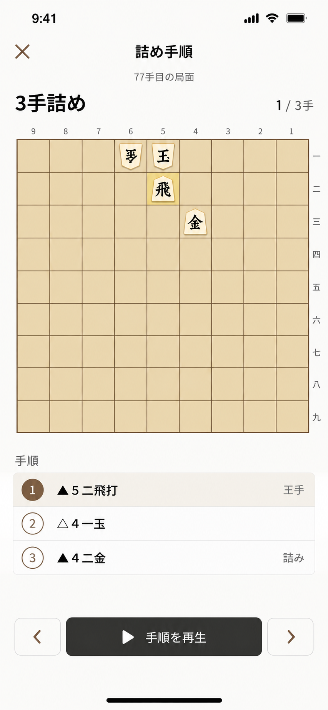
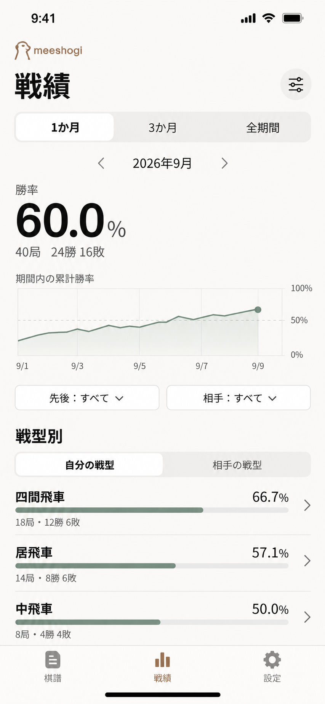
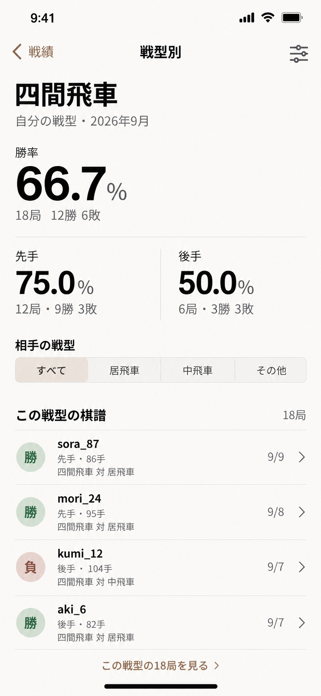
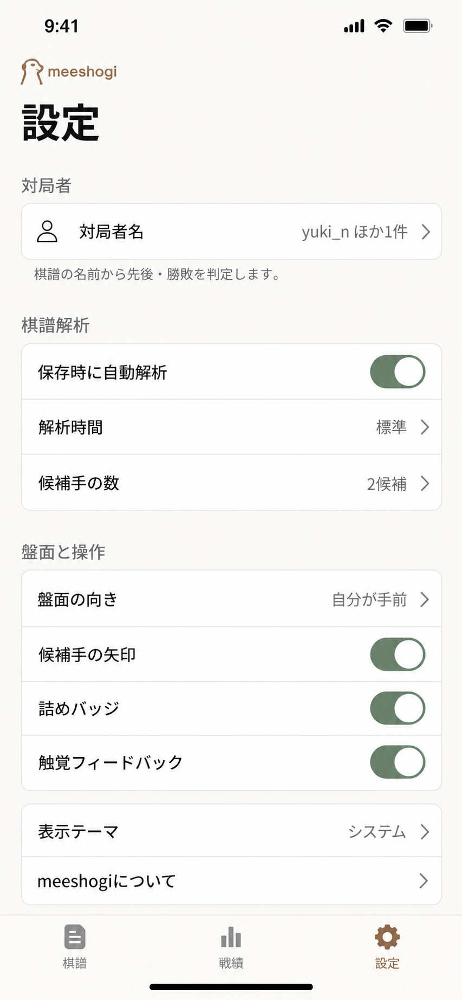
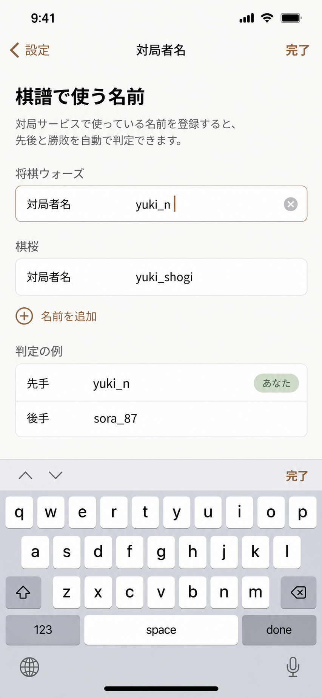

# meeshogi 採用モック

棋譜解析画面の現在の実装基準は [2026-09-22の改善内容](analysis-refresh.md) を参照する。以下の9枚は当初の静止画モックとして保持する。

2026年9月9日に採用した、ブラッシュアップ後の主要9画面。ネイティブアプリらしい落ち着いた密度、読みやすい盤面と数値、控えめなミーアキャットのマークを共通の方向とする。

製品の範囲・将棋ルール・保存と集計の条件は [PRODUCT.md](../PRODUCT.md) を正本とし、本書は画面構成と見た目の基準を補う。画像は生成した静止画であり、実装済みアプリや実機のスクリーンショットではない。

## 採用画像

各画像をクリックすると原寸で開ける。すべて853 × 1844 pxのPNG。生成後の採用版を加工せず収録している。

| 01 棋譜一覧 | 02 棋譜取り込み | 03 検討 |
| --- | --- | --- |
|  |  |  |

| 04 分岐検討 | 05 詰め手順 | 06 戦績 |
| --- | --- | --- |
|  |  |  |

| 07 戦型別戦績 | 08 設定 | 09 対局者名 |
| --- | --- | --- |
|  |  |  |

## 画面と遷移

基本タブは「棋譜」「戦績」「設定」。起動時は棋譜一覧を開く。タブを切り替えて戻ったときは、一覧の位置や選択条件を保つ。

| 画面 | 開く操作 | 主な操作・戻り先 |
| --- | --- | --- |
| 棋譜一覧 | 起動／「棋譜」タブ | 検索、お気に入り、前回の続き、対局選択。「＋」で取り込みシート |
| 棋譜取り込み | 棋譜一覧の「＋」 | 貼り付け／KIFファイル。内容を確認して「保存して検討する」。キャンセルで一覧へ |
| 検討 | 棋譜選択／取り込みの保存／前回の続き | 盤面、グラフ、候補手／棋譜、手送り。「…」にKIF書き出しなどの対局操作 |
| 分岐検討 | 検討中に本譜と異なる合法手を入力 | 分岐元と試した手を表示。「本譜に戻る」または戻る操作で分岐元の本譜局面へ |
| 詰め手順 | 証明済みの詰みバッジ | 代表手順を一手ずつ／連続再生。閉じると開く前の局面へ |
| 戦績 | 「戦績」タブ | 期間、先後・サービスなどの条件、自分／相手の戦型を選択。戦型行から詳細へ |
| 戦型別戦績 | 戦績の戦型行 | 選択条件を引き継いで先後別成績と該当棋譜を確認。対局を開き、戻ると元の条件へ |
| 設定 | 「設定」タブ | 対局者名、解析時間・候補手数、盤面と操作、表示テーマ |
| 対局者名 | 設定の「対局者名」 | サービス別の複数名と判定例。「完了」で反映し設定へ |

タブは基本3画面に表示する。詳細画面は戻る操作、取り込みはシート、詰め手順は閉じる操作を使う。iOS・Androidそれぞれの戻る操作、キーボード、セーフエリアを尊重する。

## 共通の見た目

以下は実装の開始値。生成PNGから厳密に測定した値ではなく、両OSで文字の読みやすさと操作性を確認しながら調整する。

| 用途 | 基準色 |
| --- | --- |
| 背景 | 温かみのある白 `#FAF9F6` |
| 主文・主ボタン | グラファイト `#292A27` |
| 補足文 | グレー `#76756F` |
| 選択・戻る・ブランド | サンドブラウン `#8B6C4D` |
| 勝ち・肯定状態 | セージ `#718674` |
| 負け | クレイ `#A56F61` |
| 盤面 | 薄い木色 `#EDDEC2` |

- 横余白は20、間隔は8の倍数を基本とする。グループの角丸は12〜14、シートは24を開始値とし、強い影を避けて境界線と余白で区切る。数値は論理単位として扱う。
- 大見出し32、ナビゲーションと本文17、補足13、タブラベル11を目安に、OSのシステムフォントと日本語フォールバックを使う。勝率などの主指標は大きく、桁を揃える。
- 操作領域はiOSで44 pt、Androidで48 dp以上を目安に確保する。文字サイズ変更時は折り返し・スクロールを使い、文字やボタンを切らない。
- 勝敗は淡い色面に「勝」「負」の文字を併記し、選択状態も色だけに依存しない。アイコン単独の検索・追加・手送り・閉じるには読み上げ用の名前を付ける。
- ミーアキャットは主画面の小さなブランドマークとして使う。盤面や解析値の読み取りを妨げない。
- 収録画像はライト表示。ダーク表示、文字拡大、小型画面、Android固有のシステムUIは実装時に別途確認する。画像内のステータスバーやキーボードを素材としてアプリに貼らない。

## 実装で保つ振る舞い

### 取り込みと名前

「貼り付け」を初期選択とし、ユーザーの操作でクリップボードを読む。「ファイル」はOSの選択UIからKIFを読み、同じ検証と確認画面へ渡す。保存後の自動解析は初期状態でオン。オフの場合も保存でき、検討画面から開始できる。

自分の名前はサービス別に複数登録できる。画像内の `yuki_n` などは表示サンプルであり、初回は空欄にする。名前変更後の既存対局の帰属、両者一致、自分を含まない棋譜は製品仕様の確認手順に従う。名前入力はキーボードに隠れない位置へスクロールし、入力中の欄だけにクリア操作を表示する。

### 検討・分岐・詰み

盤面は9 × 9。自分側を手前にし、座標、駒の向き、持駒、現在の手番を実際の局面から描く。評価値はグラフ・候補手とも先手視点で、正は先手有利、負は後手有利。盤面の反転で評価の視点を変えず、「先手評価」などを明示する。

先頭・前・再生／停止・次・末尾の操作を同じ順序で並べる。端では進めない方向を無効にし、現在手数と本譜の総手数を表示する。候補手の矢印は駒を隠さず、行の選択と対応させる。解析中も手送りでき、未解析区間はグラフのゼロ値として描かない。停止・再開と追加解析への導線を実装時に補う。

分岐中は分岐元の手数と「本譜に戻る」を常に見つけられる位置に置く。分岐の手順・評価を本譜のグラフや戦績と混ぜず、永続保存しない。

詰みバッジは対象局面の手番側について証明済みの場合だけ表示し、詰ませる側を明示する。画像の「77手目・3手詰め」のように現在とは別の局面を案内する場合は、対象手数を示し、現在局面の詰みと区別する。答えはタップ後に表示し、手順一覧と再生操作を一組にまとめる。代表手順の再生を全応手への詰み証明の代用にしない。

### 戦績と設定

期間・先後・サービスなどの選択条件を、主指標、グラフ、戦型別一覧、詳細、該当棋譜で一致させる。自分／相手の戦型を切り替えたときも集計の視点を見出しに残す。勝率は勝ち／（勝ち＋負け）。引き分け・中断・結果不明は別扱いとし、分母ゼロは「—」と件数で示す。

戦績グラフの意味は「選択期間内の、その時点までの累計勝率」。各点を同じ集計条件から計算し、最終点と主指標を一致させる。画像の線形状は数値の正本にしない。四間飛車の例は18局12勝6敗で66.7%、内訳は先手12局9勝3敗で75.0%、後手6局3勝3敗で50.0%。これらは表示例であり、初期データとして投入しない。

設定の「解析時間：標準」「候補手の数：2候補」は表示例。解析予算や選択肢の具体値は両OSの実測で決める。戦型の自動判定条件・未分類・手動修正の扱いも画像から推定せず、製品仕様に従う。

## 静止画に含まれない状態

採用した9枚は主要な表示状態を示す。初回の棋譜ゼロ件、検索結果なし、貼り付け前、ファイル選択のキャンセル、パース失敗、重複、保存失敗、解析中・中断・失敗、戦績の分母ゼロ、名前未登録などは、各機能の実装時に同じデザイン基準で補う。進行状況・理由・次にできる操作を短い日本語で伝える。

盤上の駒・棋譜テキスト・詰め手順・グラフには生成画像由来の不整合があり得る。画像を切り出して動的UIに使ったり、合法局面・エンジン結果・詰み証明のテストデータに転用したりしない。実装と検証には [棋譜サンプル](../../fixtures/kif/README.md) と検証済みの局面・解析結果を使う。

## 参考と検証範囲

構成検討ではAppllamaでstoicの履歴・トレンド、Day Oneの一覧・統計、Matterの閲覧・設定フローを参考にした。これらの整理の仕方をmeeshogiの棋譜・検討・戦績へ応用し、採用画像はページごとに画像生成と調整を行った。

今回確認したのは採用9枚の静止画、文書の整合、画像ファイルと参照リンク。iOS・Androidのビルド・起動・操作、アクセシビリティ、実エンジンによる解析は未検証。[開発計画](../DEVELOPMENT.md)の各段階で実装し、両OSのスクリーンショットと操作で確認する。
