# 棋譜解析画面の改善（2026-09-22）

棋桜・将棋ウォーズの公式画面を参考に、盤面の読みやすさと、指し手・評価・候補手の対応を整理した。

## 画面

- 盤面は親の幅と画面の高さから大きさを決める。盤・評価・第一候補を見渡せるようにし、小画面では盤の読みやすさを保ってスクロールする。左右の座標余白を揃え、座標・星・4pxの木枠はコードで描く。
- 対局者・手番・持駒を盤の上下にまとめる。持駒は盤上と同じ生成画像で表示し、種類が多いときは横スクロールできる。
- 直前の着手元・着手先を強調する。駒打ちは着手先だけを示す。選択中の駒、合法な移動先、候補矢印を区別する。
- 評価値・先手視点・解析状態と74pxのグラフをコンパクトにまとめる。先手優勢は緑、後手優勢は落ち着いた赤茶色で示す。線は元の評価値を結び、平滑化や勝率への変換は行わない。未解析区間も埋めず、欠測点には選択リングを出さない。
- 候補手と棋譜は下線タブで切り替える。候補を一続きの一覧にまとめ、第一候補を細い緑線で強調する。読み筋は見出しの指し手を重複させず、応手から表示する。候補の選択後は分岐を開き、盤面へスクロールする。
- 手送りは画面下部に固定し、現在の指し手を棋譜一覧と同じ日本語表記で併記する。戦型と盤面反転は上部に集約する。ナビゲーションの2行だけ文字拡大を1.1倍に制限し、本文はOSの文字拡大に従う。

追加の磨き込みでは、大きなカードの重なりと余分な縦余白を減らした。手番は色だけでなく文字でも示し、候補矢印は駒より下に描いて文字を隠しにくくした。持駒と手送りの操作領域は44pxを確保する。

## 評価値グラフの追加改善

- 正負の領域に薄い色とグラデーションを使い、ゼロ線・縦の目盛り・折れ線を見分けやすくした。データは従来どおり直線で結び、欠測区間はつながない。
- 縦軸を左側の専用領域へ移し、「+1,500／0／−1,500」を右揃えで表示する。正負を折れ線と同じ色にし、ゼロの文字と基準線を強めた。選択した数値が表示範囲を超える場合は、上下の端に小さな印を添える。グラフの高さと表示範囲は変えない。なぞっている間の読み出しはグラフ内に収め、上部の評価値と解析状態を隠さない。
- 選択中の手数を色付きのラベルで示す。横軸は対局の長さと表示幅に合う区切りにし、選択ラベルに重なる目盛りだけを省く。
- 横になぞる間は、グラフ内のカーソルと「本譜・手数・評価値」だけを更新する。指を離した位置で盤面へ一度だけ移動し、操作中の保存を連続実行しない。自動再生は操作開始時に停止する。縦方向の操作は画面スクロールへ渡し、キャンセル時は局面を変えない。
- 表示範囲は従来の±1500を維持し、読み出しには元の数値を使う。範囲を超える+2100／-2200、通常探索の+M5／-M7、欠測の「未解析」を区別する。通常探索のmateから証明済み詰みバッジを作らない。
- グラフの描画領域は74pxを維持。手数のラベルは22pxとし、盤面の高さを5px調整して第一候補まで見える配置を保つ。

| 選択中の局面 | 横になぞって別の局面を確認 |
| --- | --- |
| 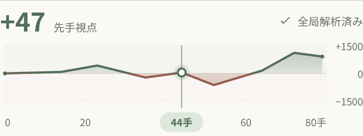 | 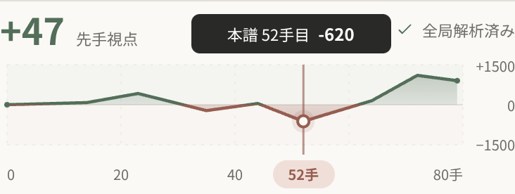 |

上の画像もWebプレビューと合成評価値による表示検証。[グラフの検証ログ](screens/analysis-refresh/graph-verification.json)に、タップ・ドラッグ・キャンセル・縦スクロール・欠測・範囲外の数値・mateの結果を記録する。

縦軸変更後のラベル位置・範囲外の印・左右端のタップ／ドラッグは、[縦軸の検証ログ](screens/analysis-refresh/axis-verification.json)に記録する。

分岐の評価と本譜のグラフ、通常探索のmateと証明済み詰みバッジの扱いは従来の製品仕様を保つ。解析エンジン・探索条件・保存形式は変更しない。

## 駒

現行の駒は、[駒セット選択](piece-sets.md)に対応し、ChatGPT Imageで生成した4セット分の地の素材8枚と独立した字形15枚を使用する。字形は歩・香・桂・銀・金・角・飛・王・玉・と・杏・圭・全・馬・龍。`PieceImage`が木地と字形の2画像を合成し、通常駒の墨色と成駒の朱色を保つ。OSフォントや他アプリの画像は使用しない。

プロンプトと画像仕様は [駒画像](../../assets/pieces/README.md) に記録する。生成画像は表示素材だけに使用し、将棋ルール・合法手・評価値の正本にはしない。

### 先手・後手の色味

以下は既定の黄楊セット。白木・桜木・青磁の選択と比較は[駒セット](piece-sets.md)を参照。

駒ごとの個別生成では木地の色にばらつきが出たため、同じ側の全種類で木地を完全に共通化した。先手は暖かい蜂蜜色、後手は深く鮮やかな飴色。木地の色は持ち主を示し、駒種による意味は持たせない。色重ね・tintは行わず、木地と文字それぞれの生成画像をそのまま描く。[共通木地の生成記録](../../assets/pieces/shared/prompts.json)と[字形の生成記録](../../assets/pieces/glyphs/prompts.json)にプロンプト・画像ハッシュを残す。

黄楊セットと字形は17枚・359,812 bytes（約0.34MiB）。駒セット追加後の現行素材は23枚・572,619 bytes（約0.55MiB）。最初の一体型15画像と旧後手14画像は生成履歴として保持し、現行アプリには同梱しない。

色は現在の持ち主に従い、反転時は回転だけを変える。捕獲した駒や打った駒も持ち主の画像になる。色だけに頼らず、駒の向き・先後の記号・読み上げを維持する。画像は従来どおり装飾として扱い、盤上・持駒・詰み手順で共通の`PieceImage`を使う。

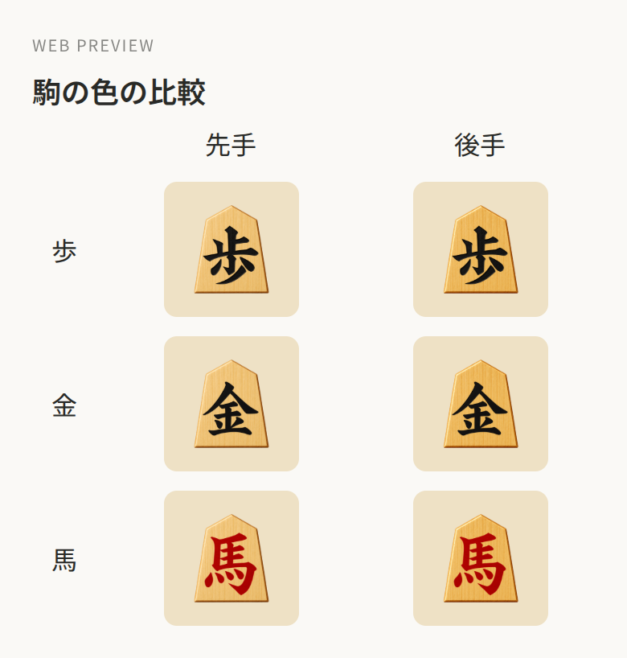

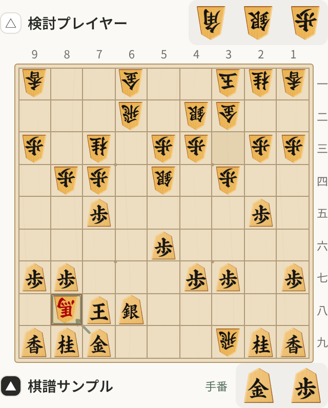

| 先手の全14種類 | 後手の全14種類 |
| --- | --- |
| 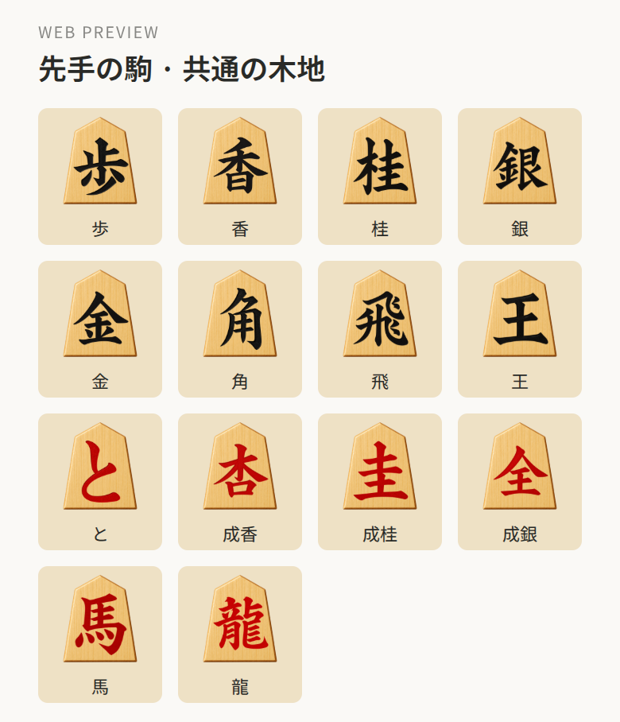 |  |

共通木地版の先手／後手各14種とライト／ダークの盤面をWebプレビューで目視し、残像や白い縁取りがないことを確認した。同じ側の全種類が同じ木地参照先・SHA-256を使い、文字外4点のサンプルで駒種間の画素差は0だった。ライト／ダーク・320px幅・盤反転・成駒6種・持駒7種・両側の捕獲→持駒→駒打ちの検証が通過し、エラーは0。[専用の検証ログ](screens/analysis-refresh/piece-shared-wood-verification.json)と[開発状況](../DEVELOPMENT.md)に結果を記録する。以下の既存ギャラリーは共通木地への変更前の表示・配置を残した履歴である。

## 参考

- [棋桜 Google Play公式掲載](https://play.google.com/store/apps/details?hl=ja&id=com.neconome.shogi)：盤面・対局者・手送り・解析グラフの配置。
- [将棋ウォーズ公式「プレミアムグラフ解析」](https://note.com/shogiwars/n/n144f8c28c5cb)：木製の一文字駒、着手の強調、グラフの現在位置。
- [将棋ウォーズ公式 棋神解析の説明](https://shogiwars.heroz.jp/help/analysis_1)：グラフからの局面移動と読み筋の再生。

参照先の画像やコードは同梱しない。

## 検証

変更後の検証結果は [開発状況](../DEVELOPMENT.md) とPRに記録する。ブラウザー上のReact Native Webプレビューと、iOS Simulator／Androidのネイティブ検証を区別する。

以下は共通木地への変更前のWebプレビューと検証履歴。実際の画面コンポーネントをReact Native Webで表示し、ナビゲーション・アイコンなどのネイティブAPIは検証用アダプターを使う。評価値は合成した表示サンプル。iOS相当のステータス領域47px・ナビゲーション44px・下余白34pxを含めている。現行の駒画像やiOS／Android実機の確認結果ではない。

| 盤面と評価 | 候補手（スクロール後） | ダーク |
| --- | --- | --- |
| 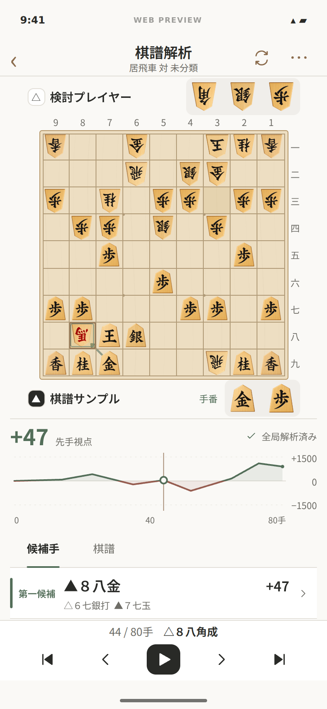 | 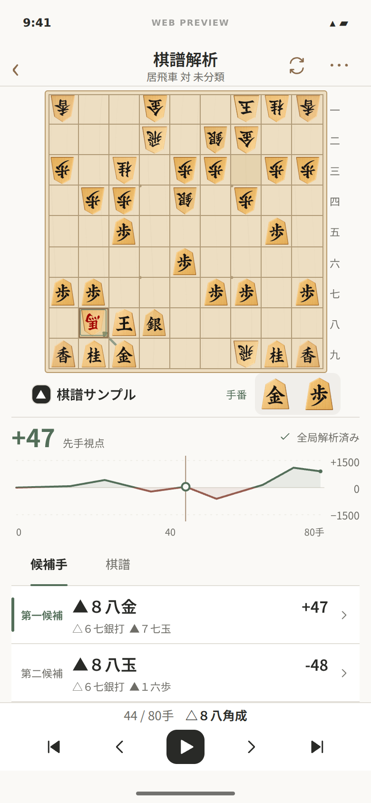 | 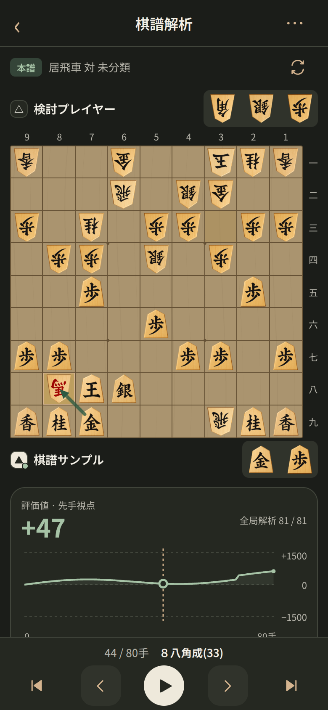 |

320px・360px・390px・768px幅、ライト／ダーク、文字1.3倍のWeb近似表示、未解析・途中解析・停止中・解析中・負の評価・全7種の持駒と6種の成駒を確認した。手送り・盤反転・グラフの両端と曲線／塗り部分からの局面移動・候補手／盤上からの分岐・本譜復帰・棋譜タブを操作した。[検証ログ](screens/analysis-refresh/verification.json)も収録する。文字拡大の近似表示は、OS自体の文字拡大検証を代替しない。

| 文字1.3倍の候補手 | 分岐を選択した直後 |
| --- | --- |
| 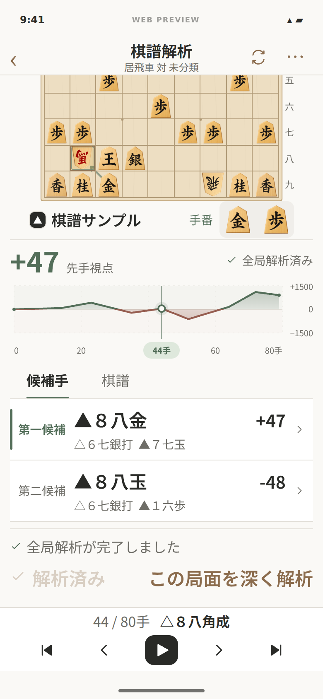 | 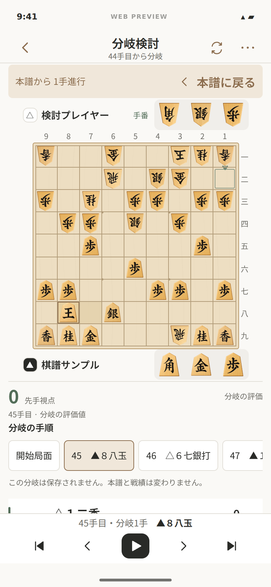 |

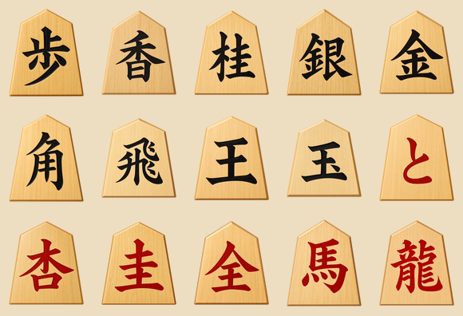
