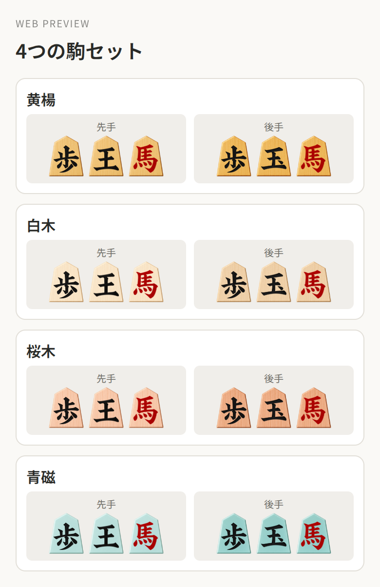
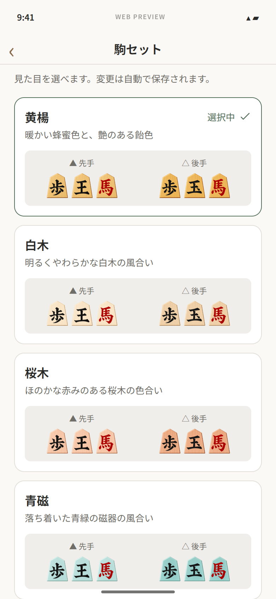
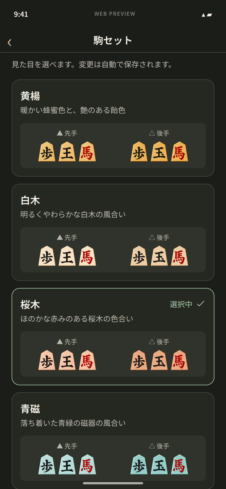
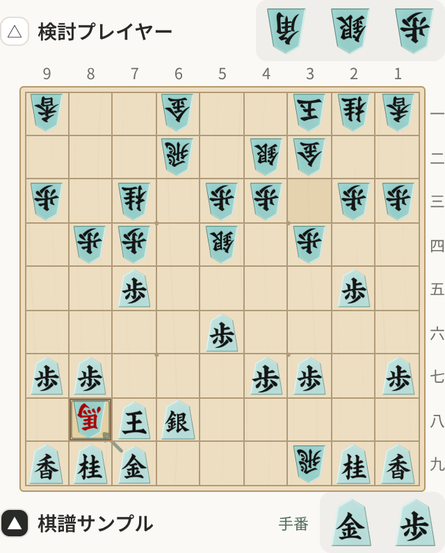
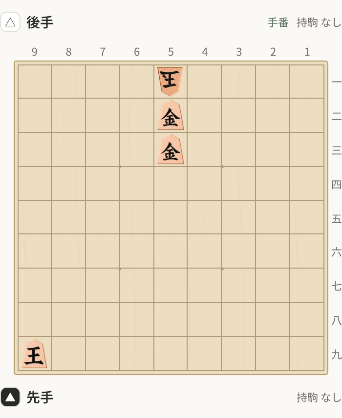

# 駒セット

設定 → 盤面と操作 → 駒セットから、先手・後手の見本を見て選ぶ。各カードは歩・王／玉・馬を表示し、通常駒と成駒の文字の見え方も比較できる。

| セット | 見た目 |
| --- | --- |
| 黄楊（初期値） | 蜂蜜色の木目。後手は深い飴色 |
| 白木 | 明るい生成り。後手は温かな亜麻色 |
| 桜木 | 淡い桃茶色の木目。後手は少し深い桜色 |
| 青磁 | 艶のある淡い青緑の磁器。後手は深い青緑 |

## 設定と反映

選択は既存の設定保存処理で端末のSQLiteへ保存する。保存成功後に選択マークと表示を更新し、盤上・持駒・詰み手順すべてに共通で反映する。再起動後も選択を保持する。保存中はカードの多重操作を防ぎ、失敗時は元の選択を保持して再試行を表示する。

既存設定に駒セットがない場合と、未知のセットIDは黄楊へ戻す。他の設定・棋譜は保持し、外観の設定だけで棋譜の読み込みを妨げない。セット変更によって解析条件や本譜を書き換えたり、進行中の解析を停止したりしない。

カードはラジオボタンとして選択状態を伝える。文字拡大に合わせて高さを伸ばし、ライト／ダーク両方で表示する。見本の後手は比較しやすいよう正立させ、実際の盤上では通常どおり手番・盤方向に従って回転する。

## 素材

地の素材はセットごとに先手用・後手用の2枚を共用する。文字はChatGPT Imageで作成済みの15字形を全セットで使う。同じセット・同じ持ち主の駒は、種類・成りにかかわらず地の素材が同じになる。色の重ね塗り、tint、OSフォントへの置き換えは行わない。

新しい6素材も組み込みのChatGPT Imageで編集生成した。元の五角形・真上視点・透過背景を保ち、素材感を変えた先手を生成し、その画像を後手の参照に使用する。生成後は透明余白・寸法の正規化とPNG最適化のみ。全23PNG・572,619 bytes（約0.55MiB）を静的に同梱する。

[素材一覧と全プロンプト](../../assets/pieces/README.md)に、入力・生成元・同梱版のハッシュを記録する。

## 検証

型検査と66テスト、両OS向けHermesバンドル生成を確認した。ホスト上のSQLiteテストで選択の保存・DB再起動後の読込と旧設定互換を検証し、ストアのテストで保存失敗時の保持・再試行・解析継続を確認した。両OSバンドルに23画像が含まれることはハッシュで照合した。

実RootLayoutと各画面のWebプレビューでは、設定からの移動、4セットの見本、全新セットの盤上・持駒・反転・詰み手順、6成駒・7持駒を確認した。ライト／ダーク・320px幅・文字1.3倍の近似表示で横はみ出しはない。保存中の選択維持・二重タップ防止、保存失敗・再試行、設定へ戻る・再読込後の反映も通過した。最終実行のページ／コンソールエラーは0件。[検証ログ](screens/piece-sets/verification.json)を参照。

Webではナビゲーション・セーフエリアと、ネイティブのアクセシビリティ属性を対応するaria属性へ変換している。保存・失敗の画面確認にはlocalStorageの検証用アダプターを使い、実際のSQLite保存テストと区別する。文字拡大はWebの近似であり、ネイティブのスクリーンリーダー確認を代替しない。

統合コミット`7f877a2`と修正後コミット`ba6c6df`のReleaseビルドをAndroid emulatorとiOS Simulatorにインストール・起動し、4セットの選択・盤上・持駒・盤反転・詰み手順・明暗・再起動後の保存を実操作で確認した。OS文字拡大も両OSで撮影した。初回にiOSの詰み手数カウンターが右端で切れる問題を見つけ、折り返し修正後は最大文字で全文を確認した。最終証拠は[Android修正後レポート](https://github.com/phni3j9a/meeshogi/blob/evidence/pr12-android-fix-20260923/evidence/report.md)と[iOS修正後レポート](https://github.com/phni3j9a/meeshogi/blob/evidence/pr12-ios-fix-20260923/report.md)を参照。実iPhone・実Android端末での操作と性能は未検証である。

| 選択画面 | ダーク |
| --- | --- |
|  |  |

| 青磁の盤面 | 桜木の詰み手順 |
| --- | --- |
|  |  |

[青磁のダーク盤面](screens/piece-sets/board-seiji-dark.webp)も確認した。画像は実コンポーネントのWebプレビューで、解析値や詰み局面は表示・操作検証用のサンプル。
